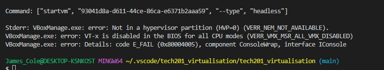

# tech201_virtualisation
tech201_virtualisation

## Devops

- Devolop automation deployment pipeline
- continuous release cycles
- automated testing
- break silos between developers and operators


## Infrastructure and architecture
infrastructure and architecture is importatn for the physical components that are needed by the cloud.


### Cloud DataCenters

- Physical computers act as servers for the public, large scale datacenters.
- Large scale of these facilities economises on cost, economies of scale achieved.
- Datacenter responsible for security, cooling infrastructur, carbon ofset, disposal of old hardware.
- High security for the datacenters ensure that customers data is safe.

### Ease of use
other teams ae going to use he tools we create. Theywont use them if they are not user freindly.

If the devs do not use our tools , then there will be delays in deployment.

### Flexibiity
Other teams are going to want to use the code. It can be easy to get locked in to using a specific product, tool or software. It then becomes hard for the company to keep up with industry changes.

Everything the company uses should be easily changed or updated as the business needs change.

### Robustness
we need to be as close to 100% uptime as possible for our companies services

we are responsible for achieving this as DevOps engineers.

### Cost
Cost is often overlooked. we need to make sure the company is being as efficient as possible in it's tech dealings

For example how powerful a machine do we need to conduct a task. do we need certain servers running.

## Dev Environments
### what makes a good dev environment
- user freindly fast and robust environment.
- It should be easy to update and change.
- It should match the production environment as closely as possible
- It should be the same for everyone everywhere
- It should support one application

App 1 require version 1.1 - App2 needs version 1.4, App1 needs a program and that program conflicts with the program that App2 needs.

### Installing ruby
- ruby is a high level language
- Download ruby from their website
- run git bash as administrator `ruby --version` to check it is installed

### Installing Virtual Box
- go to oracle virtual box website
- make sure snapshot folder is correct in -settings -general -advanced


### Installing vagrant 
- use windows features to ensure Windows Hyperviser Platform and Virtual Machine Platform are active
- make sure Hyper-V is not active
- make sure virtualbox is properly installed

### Using vagrant
- navigate to your folder using `cd /c/folder` in gitbash
- use `ls` to give status (lower(L) not 1)
- should contain files , readme etc


```vagrant init ubuntu/xenial64```

- your vagrant file should now be with other github files

- this starts the vagrant vm

```vagrant up```

- this will connect to the virtual machine

`vagrant ssh`


- to update vagrant

`vagrant reload`

- shows hidden files and folders

`ls -a` this is an L (lowercase)

- sudo (super user)
- apt-get(to get something from internet)
- update (updates the machine)
- -y (used to automate questions)
- sudo apt-get update -y

### Problem shooting vagrant



### while in virtual machine
- to confirm virtual machine has access to the internet

`sudo apt-get install nginx -y`

- cleans the screen

`clear`

- Must start system after downloading it 

`sudo systemctl start nginx`

- check the system is working
`sudo systemctl status nginx`

- to give virtual machine an IP, in vagrant file below box command

`config.vm.network "private_network", ip:"192.168.10.100"`

- to exit virtual machine

`exit`


### in vagrant system
mores

### vagrant ubuntu xenial:
in Git-Bash
in vagrant@ubuntu-xenial
`uname` # Linux
flags
`uname -a`

`uname --all`

`uname -s` #Linux

`uname -r`

`uname -m`

`uname -i` #x86_64

`uname -o`

`uname -si`#Linux x86_64

`ls -a` # bash history logout files cache

`cd .ssh` # go into .ssh

`cd ../..` go two files back

`cd ..` go file back

`cd /` go root , home

`cd ~` go home

`ls -l` gives paths

`cd test_dir` #relative path

`cd` #absolute path

`nano myfile.txt` open nano with name provided

`ls` #shows what is in folder

`mkdir new_folder` makes new folder in linux

`mkdir "folder with spaces"` for folder with spaces

`cp myfile.txt copied_file.txt`

`cat copiedfile.txt` shows file

`cp myfile.txt new_folder/copied_myfile.txt`

`cd new_folder` go into folder

`cp -rf new_folder new_folder2` r stands for recursive, copy folder and subfolders, f stands for force (do it regardless)

`cd home` also goes home

`rsync -r new_folder new_folder2` makes folder inside folder

`mv my_file2.txt new_folder`

`rm new_file.txt` removes file

`rm -rf new_folder` delete folder (and internal files)

NEVER DO THIS `rm rf` WILL DELETE ENVIRONMENT

`clear` to clear window

`grep test` to search for word test

`grep test *` for folder

`ls file*` look in file

### Linux Permissions
- r is read
- w is write
- x is execute

Owner -rwx  Group -rwx Others/All -r
`chmod` change modbits , ie - change permissions
`sudo chmod` means superuserdo, it changes permissions

`chmod u-x testfile.txt` giving permission to users
`sudo chmod 777 testfile.txt` give permission to all users

setting Read = 0 , Write = 0 , Execute - 0
Binary values: read =4 write -2 execute - 1

the total is 7 hence 777 for each group
755 would mean user can do everything group and other can read and execute
764 would mean user can do everything , group can read and write and other can read only

`ps` means processes 
`ps aux` to see processes of the entire system

`sleep 120 &` dummy process, num for 120 seconds 
`kill -9 2210` get rid of process that wont close

`sudoapt get update`

`tree` shows tree of your file / directory


## To set up node.js app
once the vagrant environment has been set up and entered with
make sure you use `vagrant up` first if you have not started virtualbox

`vagrant ssh` in git-bash to enter vm

`vagrant status` to check status

`sudo apt-get update`
this updates

`sudo apt-get install nginx -y`
to install nginx web server
`Connection to 127.0.0.1 closed by host` , return something like this


`sudo systemctl start nginx`

to start the system after downloading it

`sudo apt-get upgrade -y`


