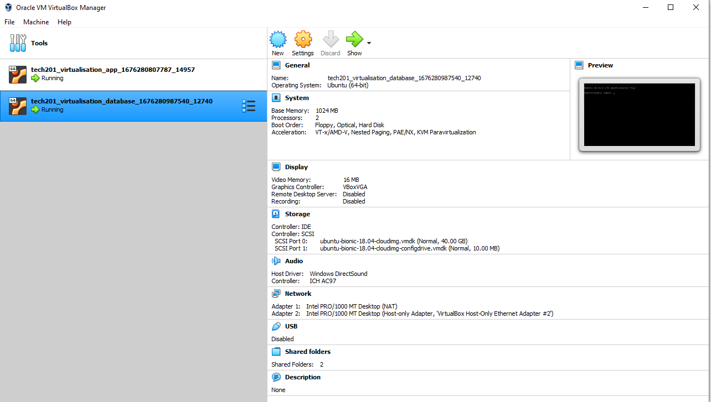

# Running Two Virtual Environments

## Vagrantfile and provision

Use this code in the Vagrantfile, the code should be seperated into two sections, app and database for the the two virtual environments that will be run simultaneously. It is important to get the format right with database and app specified at the start of the lines in each block of code. The database download insecure line may not be necessary depending on the machine.

```

Vagrant.configure("2") do |config|
  config.vm.define "app" do |app|
    app.vm.box = "ubuntu/xenial64"

    app.ssh.insert_key = false

    app.vm.network "private_network", ip:"192.168.10.100"

    app.vm.box_download_insecure = true

    app.vm.synced_folder "app","/home/vagrant/app"

    #Provisioning
    app.vm.provision "shell", path: "provision.sh", privileged: false
    

  end

  config.vm.define "database" do |database|
    database.vm.box = "ubuntu/bionic64"
    database.vm.network "private_network", ip: "192.168.10.150"
    database.vm.box_download_insecure = true
    database.vm.synced_folder "environment", "/home/vagrant/environment"
  end
end

```

The provisionfile should look like this, -y automatically confirms choices:

```
#!/bin/bash
sudo apt-get install nginx -y
sudo systemctl enable nginx -y
sudo rm /etc/nginx/sites-available/default
sudo cp app/reverse_proxy /etc/nginx/sites-available/default
sudo systemctl restart nginx -y
sudo apt-get install python-software-properties
curl -sL https://deb.nodesource.com/setup_12.x | sudo -E bash -
sudo apt-get install nodejs -y
sudo npm install pm2 -g
```

### When ready it should look like this -



## Configuring the Database

In VS code Terminal, There should be two virtual environments in oracle virtual box as a result, if there is not then this command must be run twice.

`vagrant up`

to enter the database virtual environment

`vagrant ssh database`

run the code to get the database key and then check the command went through succesfully.

`sudo apt-key adv --keyserver hkp://keyserver.ubuntu.com:80 --recv D68FA50FEA312927`

`echo "deb https://repo.mongodb.org/apt/ubuntu xenial/mongodb-org/3.2 multiverse" | sudo tee /etc/apt/sources.list.d/mongodb-org-3.2.list #should return deb https://repo.mongodb.org/apt/ubuntu xenial/mongodb-org/3.2 multiverse`

update and then upgrade the system :

`sudo apt-get update -y`

`sudo apt-get upgrade -y`

install the database version

`sudo apt-get install mongodb-org=3.2.20 -y`

install database

`sudo apt-get install -y mongodb-org=3.2.20 mongodb-org-server=3.2.20 mongodb-org-shell=3.2.20 mongodb-org-mongos=3.2.20 mongodb-org-tools=3.2.20`

Start and enable the database

`sudo systemctl start mongod`

`sudo systemctl enable mongod`

Check the status of the database

`sudo systemctl status mongod`

Open database configuration editor to make changes that can let this be accessed. It is important not to change the Ip to this in a production environment because of the security risks of leaving this port open with easy access.

`sudo nano /etc/mongod.conf`

Change bindIp: 127.0.0.1  to bindIp: 0.0.0.0 using the commands listed in the program. `CTRL x` to exit and save in the file that is already made.

Then we must restart and enable the database

`sudo systemctl restart mongod`

`sudo systemctl enable mongod`

## App Virtual Machine

Run the command to enter the app

`vagrant ssh app`

Navigate to the app folder that contains app.js in it by useing :

`cd app`

To check what is in the folder, app.js should be listed.

`ls`

Create the environment for posts folder using mongodb.

`export DB_HOST=mongodb://192.168.10.150:27017/posts`

to check that this is correct use the following code to give the host address. 

` printenv DB_HOST ` #mongodb://192.168.10.150:27017/posts

seed the app

`node seeds/seed.js`

finally set up the app with the following code.

`node app.js`

we should now be able to see our sparta page on port 3000. navigate to http://192.168.10.100:3000/posts in your browser.


### Troubleshooting

If port 3000 is already occupied then it is necassary to find and remove the process responsible and then restart the server.

`sudo lsof -i :3000`

`kill -9 number`

Insert the number where number is written for the port.


### using mongodb

`export DB_HOST=mongodb://192.168.10.150:27017/posts`
`printenv DB_HOST` # to print the host

`cd app`
`npm install` 
`node seeds/seed.js` set up database
