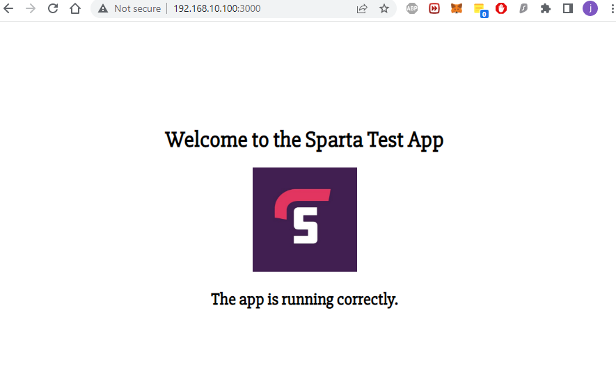

<!-- Steps to complete:
Create provision.sh in the same directory as your Vagrantfile
Add #!/bin/bash to the top of the file
Add commands to set up Nginx webserver and start it
Checkpoint 1 -> Time to check the VM I.P: 192.168.10.100
Does it show Nginx homepage? If so let's continue!
Add commands to your shell file to install nodejs on the vm (version 6 needed remember)
Add command to install pm2
Checkpoint 2 -> Log into your VM and see if you can start the app? Is it visible when you access 192.168.10.100:3000?
If so, add commands to start the app into your shell script
When this works you should just be able to run 'vagrant up' and all dependencies will be present when you log in to the VM. You should just be able to log in with 'vagrant ssh' and cd in app/app -> run one command:
'npm start' or 'node app.js'
and the app will start.
If you complete this, write up the steps and guidance into your README. Include screenshots of the important steps and solution code for:
provision.sh
Vagrantfile -->
# Setting up Provision for automation of tasks
## Creating provision file
The provision file can be created in the same directory as your vagrantfile. make sure your vagrantfile looks like this:

```
Vagrant.configure("2") do |config|

  config.vm.box = "ubuntu/xenial64"

  config.ssh.insert_key = false

  config.vm.network "private_network", ip:"192.168.10.100"

  config.vm.box_download_insecure = true

  config.vm.synced_folder "app","/home/vagrant/app"

  #Provisioning
  config.vm.provision "shell", path: "provision.sh"
  

end
```

`provision.sh`

In The provisional file the following lines should be added

```
#!/bin/bash

# update and upgrade
sudo apt-get update -y
sudo apt-get upgrade -y

# install nginx
sudo apt-get install nginx -y

# Enable or Start Nginx
sudo systemctl enable nginx -y

sudo apt-get install python-software-properties
#nodejs download
curl -sL https://deb.nodesource.com/setup_6.x |sudo -E bash -
sudo apt-get install nodejs -y

#install pm2
sudo npm install pm2 -g
npm install

#go to app folder
cd app/app/

#install nodejs
node app.js

# exit 
#npm start
```

If you have not done so already -

`vagrant destroy`

`vagrant up`

Now we can check are web server at `192.168.10.100` in our browser

We should be able to see our home page and also find our app at `192.168.10.100:3000`

